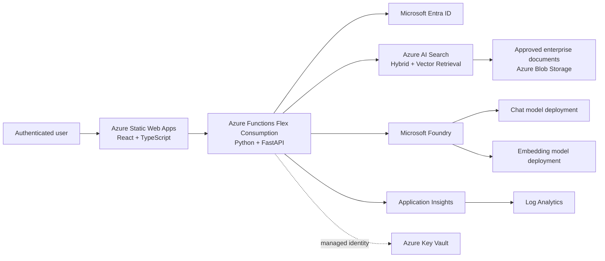
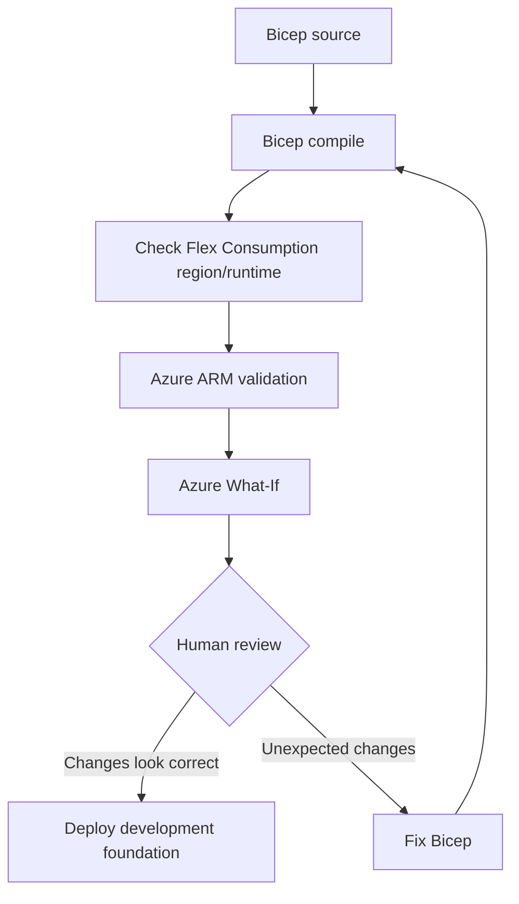

# BHT Insight Foundry

Open-source enterprise knowledge assistant built with Microsoft Foundry, Azure OpenAI, Azure AI Search, Azure Functions Flex Consumption, Azure Static Web Apps, and Python.

> **Phase 1A status:** Serverless Azure foundation is under active development on `agent/phase-1a-end-to-end-rag`.

## Phase 1A goal

Build an end-to-end enterprise RAG solution without dedicated VM or App Service worker quota dependencies.



### Legend

| Component | Purpose |
|---|---|
| Azure Static Web Apps | Hosts the React/TypeScript frontend |
| Azure Functions Flex Consumption | Serverless Python/FastAPI API; avoids dedicated App Service B1 worker quota |
| Microsoft Foundry | AI project and model-management plane |
| Azure OpenAI model deployments | Chat generation and embeddings |
| Azure AI Search | Hybrid/vector retrieval for RAG |
| Azure Blob Storage | Approved, quarantined, and rejected knowledge documents |
| Microsoft Entra ID | User identity and Azure-to-Azure authentication |
| Managed identity + RBAC | Keyless access between Azure services |
| Application Insights + Log Analytics | Telemetry, failures, latency, and operational diagnostics |
| Key Vault | Secrets only where managed identity cannot be used |

## Explicitly not used in Phase 1A

- Dedicated B1 App Service Plan
- Azure virtual machines / Bsv2
- Docker
- Azure Container Registry
- Azure Container Apps
- AKS

## Engineering principles

- Security by default and least privilege
- Managed identity instead of API keys wherever supported
- Small, reviewable changes through pull requests
- Automated linting, formatting, type checking, testing, and security scanning
- Visual architecture, data-flow, control-flow, and deployment documentation
- No secrets, customer data, or confidential prompts in GitHub
- Measured latency, token usage, retrieval quality, reliability, and Azure cost
- Purposeful comments that explain design intent and non-obvious behavior

## Phase 1A deployment safety flow



The deployment script does **not** deploy by default. Use `-Deploy` only after reviewing the Azure What-If output.

## Provisioning commands

```powershell
# Get the Phase 1A branch
git fetch origin
git checkout agent/phase-1a-end-to-end-rag
git pull origin agent/phase-1a-end-to-end-rag

# Compile only
az bicep build --file .\infra\bicep\main.bicep

# Preflight + What-If only (no deployment)
.\scripts\deploy-phase1a-serverless.ps1 `
  -ResourceGroup "rg-bht-insight-dev" `
  -Location "eastus2" `
  -Environment "dev"

# After reviewing What-If, deploy intentionally
.\scripts\deploy-phase1a-serverless.ps1 `
  -ResourceGroup "rg-bht-insight-dev" `
  -Location "eastus2" `
  -Environment "dev" `
  -Deploy
```

> Keep `deployModels=false` on the first infrastructure deployment. Chat and embedding model versions/capacity are enabled only after regional availability and quota are verified in the target subscription.

## Planned editions

1. **BHT Insight Foundry** — Microsoft Foundry/Azure AI only
2. **BHT Insight Copilot Studio** — Copilot Studio only
3. **BHT Insight Hybrid** — Microsoft Foundry plus Copilot Studio

## Repository map

```text
.github/workflows/              CI and security automation
docs/architecture/             Architecture and data-flow diagrams
docs/deployment/               Deployment procedures and validation
infra/bicep/                    Azure infrastructure as code
scripts/                        Guarded provisioning and developer scripts
src/bht_insight/                Python application code
tests/                          Unit, integration, security, and evaluation tests
```

## Current Phase 1A infrastructure

- Microsoft Foundry account and project
- Azure AI Search
- Knowledge Storage account with approved/quarantine/rejected containers
- Separate Azure Functions runtime/deployment Storage account
- Azure Functions Flex Consumption plan and Function App
- Azure Static Web Apps Standard
- Azure Key Vault
- Application Insights
- Log Analytics
- Managed identities and least-privilege Azure RBAC
- Optional chat and embedding model deployments, disabled until quota/model checks pass

## Documentation

Start with:

- `docs/architecture/serverless-phase-1a.md`
- `docs/deployment/phase1a-serverless.md`
- `docs/security/threat-model.md`

## License

MIT. See [LICENSE](LICENSE).
