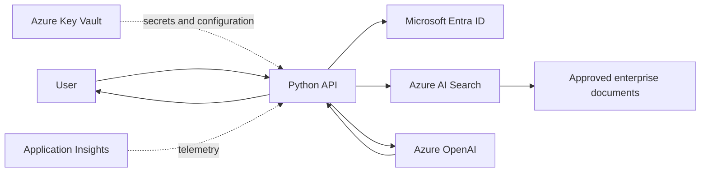

# BHT Insight Foundry

Open-source enterprise knowledge assistant built with Azure AI Foundry, Azure OpenAI, Azure AI Search, and Python.

> Status: Repository foundation and engineering controls are being established.

## What this project will demonstrate

BHT Insight Foundry will show how to build a secure, efficient, well-documented enterprise knowledge assistant using Microsoft Azure AI technologies.



## Engineering principles

- Security by default
- Small, reviewable changes
- No direct pushes to `main`
- Automated linting, formatting, type checking, testing, and security scanning
- Clear architecture, data-flow, and control-flow documentation
- No secrets or customer data in the repository
- Measured performance, cost, and retrieval quality
- Purposeful comments that explain *why*, not obvious code behavior

## Planned editions

1. **BHT Insight Foundry** — Azure AI Foundry only
2. **BHT Insight Copilot Studio** — Copilot Studio only
3. **BHT Insight Hybrid** — Azure AI Foundry plus Copilot Studio

## Repository map

```text
src/bht_insight/       Application code
tests/                 Unit, integration, security, and evaluation tests
docs/architecture/     Architecture diagrams and explanations
docs/decisions/        Architecture Decision Records
docs/security/         Threat model and security design
infra/bicep/           Azure infrastructure as code
.github/workflows/     CI and security automation
```

## Local setup

Run the Windows setup script from PowerShell:

```powershell
Set-ExecutionPolicy -Scope Process Bypass
.\scripts\setup-windows.ps1
```

## License

MIT. See [LICENSE](LICENSE).
