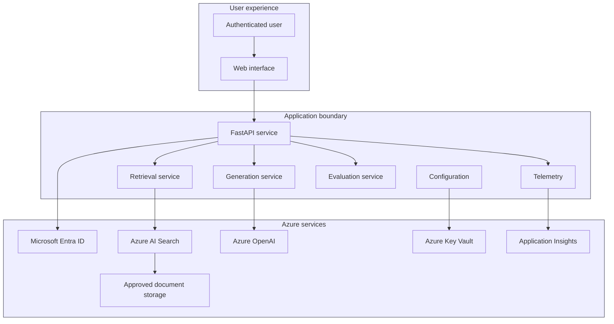

# Architecture

## High-level architecture

## Legend

| Symbol | Meaning |
|---|---|
| Solid arrow | Runtime request or data flow |
| Dotted relationship | Configuration, secret, or telemetry relationship |
| Boundary | Security or responsibility zone |

## Core rule

The model must not answer from unsupported knowledge when the solution is configured for grounded enterprise responses. When retrieval produces insufficient evidence, the application must return a transparent “not found in approved sources” response.
