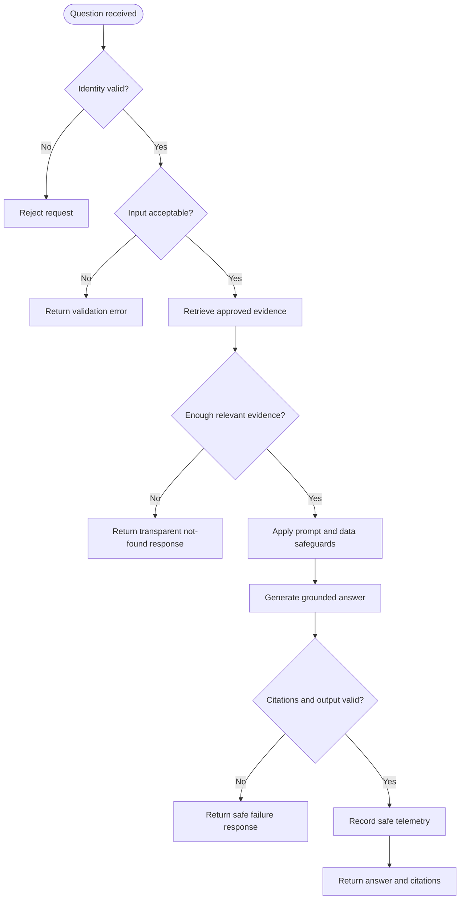

# Control Flow

```mermaid
flowchart TD
    START([Question received]) --> AUTH{Identity valid?}
    AUTH -- No --> DENY[Reject request]
    AUTH -- Yes --> VALIDATE{Input acceptable?}
    VALIDATE -- No --> BAD[Return validation error]
    VALIDATE -- Yes --> RETRIEVE[Retrieve approved evidence]
    RETRIEVE --> FOUND{Enough relevant evidence?}
    FOUND -- No --> NOTFOUND[Return transparent not-found response]
    FOUND -- Yes --> GUARD[Apply prompt and data safeguards]
    GUARD --> GENERATE[Generate grounded answer]
    GENERATE --> VERIFY{Citations and output valid?}
    VERIFY -- No --> SAFEFAIL[Return safe failure response]
    VERIFY -- Yes --> LOG[Record safe telemetry]
    LOG --> RETURN[Return answer and citations]
```

## Legend

| Shape | Meaning |
|---|---|
| Rounded | Start or end |
| Diamond | Decision or policy gate |
| Rectangle | Processing step |
