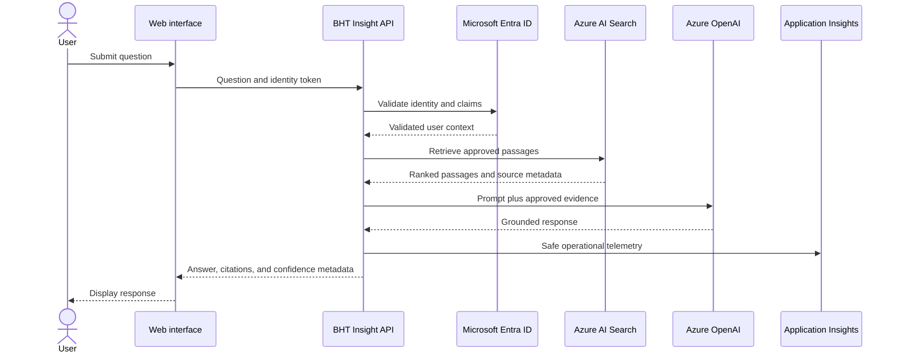

# Data Flow

## Data handling rules

- Do not send documents to the model unless retrieval selected them for the current request.
- Do not expose content the authenticated user is not authorized to access.
- Do not place secrets in prompts, logs, or source metadata.
- Return citations to approved sources.
