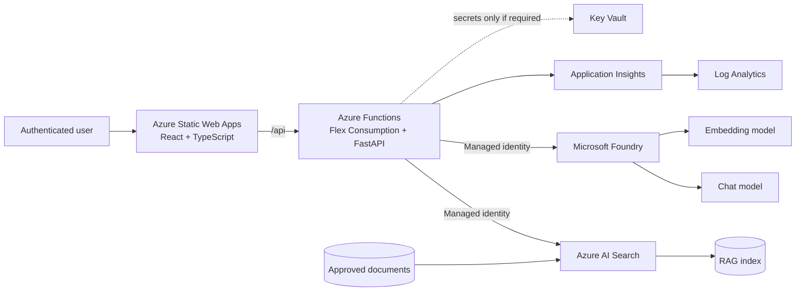

# Phase 1A Serverless Architecture

BHT Insight Phase 1A uses a quota-light serverless web tier so the AI build is not blocked by dedicated App Service worker quota.



## Legend

| Item | Meaning |
|---|---|
| Solid arrow | Runtime request or data flow |
| Dotted arrow | Configuration or optional dependency |
| Managed identity | Keyless Microsoft Entra authentication between Azure resources |

## Why this architecture

- Removes the dedicated B1 App Service worker that triggered quota rejection.
- Keeps Microsoft Foundry, Azure OpenAI, Azure AI Search, and RAG as the core AI learning path.
- Uses Azure Functions Flex Consumption for independently managed Python/FastAPI APIs.
- Uses Azure Static Web Apps Standard so the standalone Function App can be linked as the `/api` backend.
- Keeps Docker, AKS, Container Apps, Redis, Cosmos DB, and API Management out of Phase 1A.

## Security boundaries

1. The browser never receives Azure service credentials.
2. The Function App uses managed identity for Foundry, Azure AI Search, Storage, and Key Vault.
3. Source documents are private blobs; public blob access is disabled.
4. Azure AI Search local authentication is disabled.
5. Foundry local authentication is disabled.
6. Application telemetry must not record full source documents, secrets, or sensitive prompts by default.

## Quota check before deployment

Flex Consumption availability varies by region. Before deploying, run:

```powershell
az functionapp list-flexconsumption-locations --query "sort_by(@, &name)[].{Region:name}" -o table
az functionapp list-flexconsumption-runtimes --location eastus2 --runtime python --query "[].{version:version}" -o table
```

If East US 2 is unavailable for Flex Consumption or the desired Python runtime, select a supported region before deployment rather than requesting dedicated App Service VM quota.
