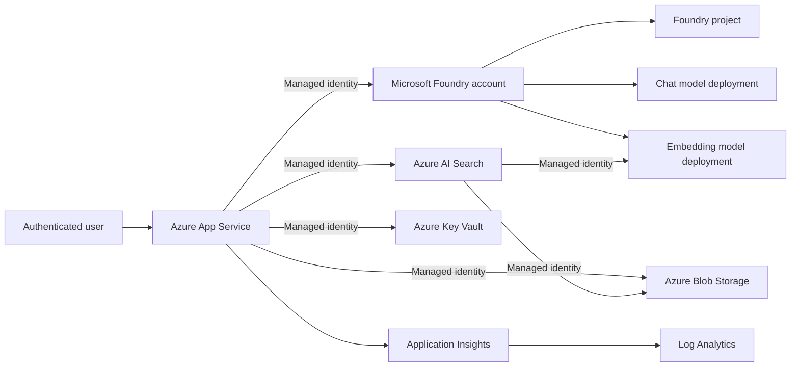

# Phase 1A Azure Resource Deployment

## Purpose

This deployment creates the Azure foundation for the BHT Insight Foundry end-to-end RAG web application.

It provisions infrastructure only. It does not upload documents, create the Azure AI Search index/skillset/indexer, configure App Service Microsoft Entra authentication, or deploy application code. Those items require application-specific values and are implemented in subsequent work.

## Provisioned architecture



### Legend

| Relationship | Meaning |
|---|---|
| Solid arrow | Runtime or service-to-service access |
| Managed identity | Microsoft Entra token-based authentication without stored API keys |
| Optional model deployment | Created only when `deployModels = true` |

## Resources

| Resource | Purpose | Initial tier |
|---|---|---|
| Microsoft Foundry account | Central AI resource and model hosting | S0 |
| Foundry project | Development, evaluation, and tracing boundary | Project child resource |
| Chat model deployment | Generates grounded answers | Parameterized Standard deployment |
| Embedding deployment | Creates vectors for indexing and query-time vectorization | Parameterized Standard deployment |
| Azure AI Search | Hybrid, semantic, and vector retrieval | Basic |
| Storage account | Approved, quarantined, and rejected documents | Standard LRS |
| App Service Plan | Linux compute for the web application | B1 |
| App Service | React/FastAPI application host | System-assigned identity |
| Key Vault | Future non-Entra secrets | Standard |
| Application Insights | Application telemetry | Workspace-based |
| Log Analytics | Central log store | 30-day development retention |

## Security defaults

- Local authentication is disabled on Microsoft Foundry and Azure AI Search.
- Storage public blob access is disabled.
- Storage defaults to OAuth authentication.
- App Service uses HTTPS only and TLS 1.2 minimum.
- FTP/FTPS deployment is disabled.
- Managed identities are used for service-to-service access.
- Key Vault uses Azure RBAC and soft delete.
- Role assignments are intentionally read-only for the runtime web application.

## Why model deployment is initially disabled

Model availability, supported versions, and quota differ by Azure region and subscription. The default parameter file uses `deployModels = false` so the stable infrastructure can be provisioned first without guessing a model version.

Before enabling models:

1. Sign in to Azure CLI.
2. Select the intended subscription.
3. Verify available models and quota for the deployed Foundry account and region.
4. Update `chatModelVersion` and, if required, `embeddingModelVersion` in `dev.bicepparam`.
5. Set `deployModels = true`.
6. Run the provisioning script again. Bicep performs an incremental update.

The embedding model must be one supported by Azure AI Search integrated vectorization. `text-embedding-3-small` is the initial design choice, but the deployed version must be verified in the target region.

## Deployment procedure

### 1. Pull the feature branch

```powershell
git fetch origin
git switch agent/phase-1a-end-to-end-rag
git pull
```

### 2. Sign in and identify the subscription

```powershell
az login
az account list --output table
```

### 3. Customize parameters

Open:

```text
infra/bicep/dev.bicepparam
```

At minimum, change `uniqueSuffix`. Keep it between 3 and 8 lowercase letters or numbers.

Confirm that `location` supports:

- Microsoft Foundry
- The intended chat model
- The intended embedding model
- Azure AI Search

### 4. Build the template locally

```powershell
az bicep build --file .\infra\bicep\main.bicep
```

Delete the generated `main.json` afterward; Bicep remains the source of truth.

### 5. Run the guarded provisioning script

```powershell
.\infra\scripts\provision-phase1a.ps1 `
  -SubscriptionId "YOUR-SUBSCRIPTION-ID" `
  -ResourceGroupName "rg-bht-insight-dev-eastus2" `
  -Location "eastus2"
```

The script performs:

```text
Azure login check
      ↓
Subscription selection
      ↓
Provider registration
      ↓
Resource group creation
      ↓
Bicep validation
      ↓
What-if preview
      ↓
Explicit DEPLOY confirmation
      ↓
Incremental deployment
      ↓
Output display
```

## Permissions required

The deploying identity needs permission to:

- Create resources in the resource group.
- Create Azure role assignments.

In many tenants this means Contributor plus User Access Administrator, or Owner at the resource group/subscription scope. Use the least privilege allowed by your tenant governance.

## Resources intentionally deferred

The following are not created yet:

- Microsoft Entra app registration and App Service authentication configuration
- Azure AI Search index, data source, skillset, vectorizer, and indexer
- App Service deployment slot
- Front Door or Web Application Firewall
- Private endpoints and VNet integration
- Cosmos DB conversation history
- Azure Cache for Redis
- Service Bus ingestion queue
- Microsoft Purview integration

These are deferred because they require either tenant-specific identity details, application code, or Phase 1A production-hardening decisions.

## Expected outputs

After deployment, Bicep returns:

- Foundry account and project names
- Foundry endpoint
- Azure AI Search endpoint
- Storage account and approved-container names
- Key Vault URI
- App Service URL and managed identity principal ID
- Search managed identity principal ID
- Application Insights and Log Analytics names

## Validation checklist

- [ ] All deployment operations report `Succeeded`.
- [ ] App Service has a system-assigned managed identity.
- [ ] Azure AI Search has a system-assigned managed identity.
- [ ] Search can read the storage account through RBAC.
- [ ] Search can call the Foundry resource through RBAC.
- [ ] App Service can query Search and call Foundry through RBAC.
- [ ] No API keys are present in App Service settings.
- [ ] Storage containers have no public access.
- [ ] Application Insights is linked to Log Analytics.
- [ ] The Bicep what-if result contains no unexpected deletion.
