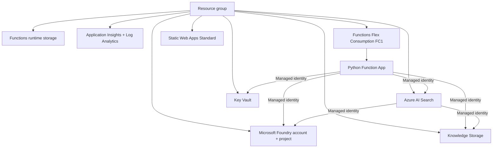

# Phase 1A Serverless Deployment Runbook

## Objective

Deploy the BHT Insight Phase 1A foundation without a dedicated B1 App Service worker or VM quota dependency.

The deployment creates:



## Important scope

This deployment does **not** create:

- B1 App Service
- Dedicated App Service workers
- Azure virtual machines
- Docker resources
- Azure Container Registry
- Azure Container Apps
- AKS
- Model deployments on the first pass

## Step 1 - Get the serverless branch

```powershell
git fetch origin
git checkout agent/phase-1a-end-to-end-rag
git pull origin agent/phase-1a-end-to-end-rag
```

## Step 2 - Confirm Azure sign-in

```powershell
az login
az account show --query "{Subscription:name,SubscriptionId:id,TenantId:tenantId}" -o table
```

If needed:

```powershell
az account set --subscription "<subscription-id>"
```

## Step 3 - Trust but verify regional serverless availability

Do not request B1/Bsv2 quota for this architecture. Check Flex Consumption directly:

```powershell
az functionapp list-flexconsumption-locations --query "sort_by(@, &name)[].{Region:name}" -o table
az functionapp list-flexconsumption-runtimes --location eastus2 --runtime python --query "[].{Version:version}" -o table
```

If `eastus2` or Python 3.12 is unavailable, select a supported combination.

## Step 4 - Compile Bicep

```powershell
az bicep build --file .\infra\bicep\main.bicep
```

Do not continue if compilation fails.

## Step 5 - Run the safe preflight

The deployment script defaults to `what-if` and does not deploy unless `-Deploy` is provided.

```powershell
.\scripts\deploy-phase1a-serverless.ps1 `
  -ResourceGroup "rg-bht-insight-dev" `
  -Location "eastus2" `
  -Environment "dev"
```

The script:

1. Confirms the active Azure subscription.
2. Confirms Flex Consumption availability in the selected region.
3. Confirms the requested Python runtime is supported.
4. Registers required Azure resource providers.
5. Creates the resource group only if needed.
6. Compiles Bicep.
7. Executes Azure Resource Manager `what-if`.
8. Stops without deploying.

Copy the generated unique suffix shown by the script.

## Step 6 - Deploy only after reviewing what-if

Example:

```powershell
.\scripts\deploy-phase1a-serverless.ps1 `
  -ResourceGroup "rg-bht-insight-dev" `
  -Location "eastus2" `
  -Environment "dev" `
  -UniqueSuffix "abc12" `
  -PythonVersion "3.12" `
  -Deploy
```

## Step 7 - Verify deployed resources

```powershell
az resource list `
  --resource-group rg-bht-insight-dev `
  --query "[].{Name:name,Type:type,Location:location}" `
  --output table
```

Expected major resources:

| Resource | Purpose |
|---|---|
| Microsoft Foundry account/project | AI engineering, model connections, evaluations |
| Azure AI Search | RAG retrieval |
| Knowledge Storage | Approved/quarantine/rejected documents |
| Functions Storage | Function host state and deployment packages |
| Function App on FC1 | Python/FastAPI API |
| Static Web Apps Standard | React frontend |
| Key Vault | Secrets only when managed identity is not possible |
| Application Insights | Application telemetry |
| Log Analytics | Centralized logs |

## Step 8 - Model deployment is separate

The first infrastructure deployment uses `deployModels=false` on purpose. Model availability and quota are checked after the Foundry account exists. This prevents a model-region/version issue from blocking the entire infrastructure deployment.

## Step 9 - Frontend/API linking happens after code deployment

A separately managed Azure Functions backend requires Static Web Apps Standard. After the React application and Function App code exist, link the backend through Azure CLI or the Azure portal. The frontend will then reach the backend through the Static Web Apps `/api` route.

## Rollback / cleanup

For a disposable development environment, delete the resource group only after confirming that it contains no unrelated resources:

```powershell
az group delete --name rg-bht-insight-dev --yes --no-wait
```

Never run destructive cleanup against a shared or production resource group.
